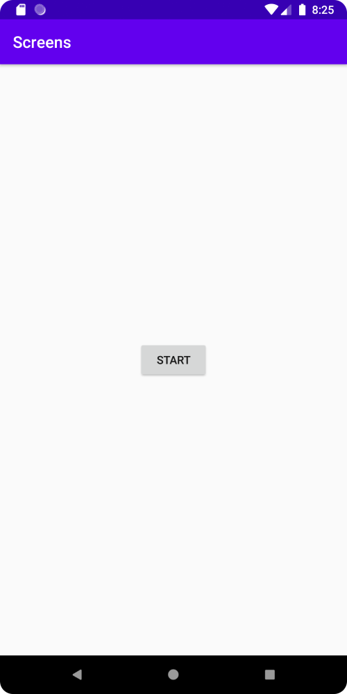
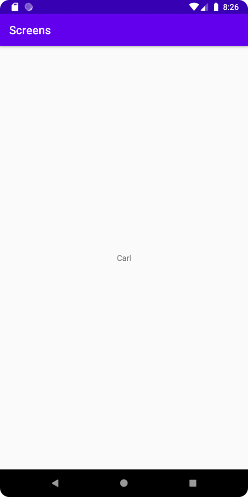

# Rapport

Först skapades en ny activity. Detta gjordes genom att använda app/New/Activity/Empty Activity.

Sedan lades en knapp till i den första activityn. Denna knapp startar den andra activityn.
Knappen använder en OnClickListener för att exekvera kod när knappen klickas på.
Data skickas även vidare till den andra activityn. Detta görs genom att använda Intent.

Koden inuti activity_main.xml ser ut som följande:

```
<Button
        android:id="@+id/startButton"
        android:layout_width="wrap_content"
        android:layout_height="wrap_content"
        android:text="Start"
        app:layout_constraintBottom_toBottomOf="parent"
        app:layout_constraintEnd_toEndOf="parent"
        app:layout_constraintStart_toStartOf="parent"
        app:layout_constraintTop_toTopOf="parent" />
```

Koden inuti MainActivity.java ser ut som följande:

```
Button startButton = findViewById(R.id.startButton);
startButton.setOnClickListener(new View.OnClickListener() {
    @Override
    public void onClick(View view) {
    Intent intent = new Intent(MainActivity.this, SecondActivity.class);
    intent.putExtra("name", "Carl");
    startActivity(intent);
    }
});
```

Sedan lades en TextView till i den andra activityn.
Detta gjordes genom att lägga till kod inuti activity_second.xml.

Koden ser ut som följande:

```
<TextView
        android:id="@+id/name"
        android:layout_width="wrap_content"
        android:layout_height="wrap_content"
        android:text="Name"
        app:layout_constraintBottom_toBottomOf="parent"
        app:layout_constraintEnd_toEndOf="parent"
        app:layout_constraintStart_toStartOf="parent"
        app:layout_constraintTop_toTopOf="parent" />
```

Datan som skickades med från den första activityn visas sedan inuti TextViewen.
Detta gjordes genom att lägga till kod inuti SecondActivity.java.
Koden hämtar först datan, sedan om det finns någon data så sätts TextView texten till respektive data.

Koden ser ut som följande:
```
TextView name = findViewById(R.id.name);
Bundle extras = getIntent().getExtras();
if (extras != null) {
    String nameString = extras.getString("name");
    name.setText(nameString);
    }
```

Den första activityn ser ut som följande:



Den andra activityn ser ut som följande:


